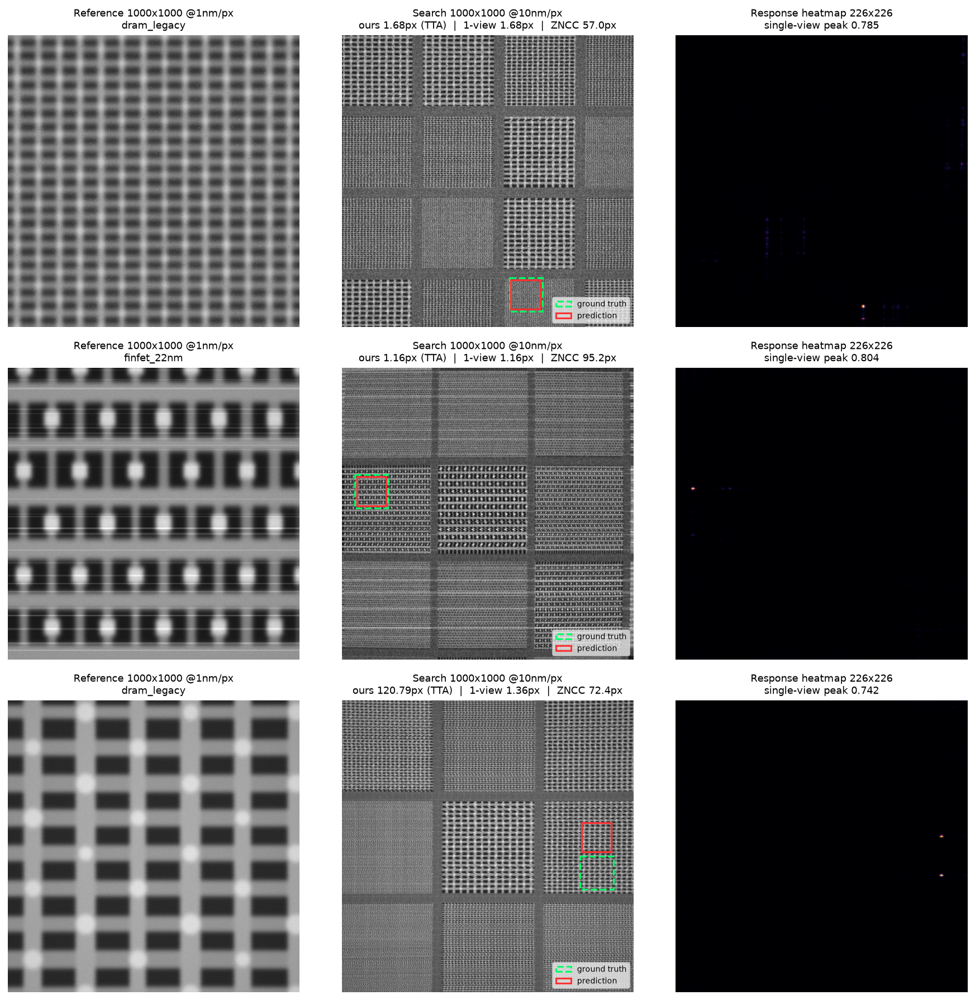

# Drift-Sense — Navigation-Error Recovery, Phase 2

Locate a high-resolution **Reference** patch inside a low-resolution **Search**
frame of a repeating semiconductor layout, and report where it is — position,
rotation, scale, and whether it's there at all. This is Applied Materials'
*Navigation-Error Recovery* problem, Phase 2: unknown pose, possible absence.

|            | Reference        | Search             |
| ---------- | ---------------- | ------------------ |
| size       | 1000 × 1000 px   | 1000 × 1000 px     |
| pixel size | 1 nm/px          | `z` nm/px, `z ∈ [8, 12]`, unknown per pair |
| field      | 1 µm             | ~8–12 µm            |

Phase 1 fixed the zoom at exactly 10× and guaranteed the reference was always
present. Phase 2 removes both assumptions — the zoom is unknown in `[8, 12]`,
the rotation is unknown in `±5°` (CCW positive) and must be reported, and
about 20% of pairs contain **no true instance** at all. The underlying
localiser is the Phase 1 network, extended rather than replaced: see
[How it works](#how-it-works).

## Entry point & output contract

```bash
python register.py --input pairs.csv --output predictions.csv
```

One row per input pair, in input order: `pair_id, x, y, theta, scale, found,
score`. `x, y` is the match centre in Search-image pixels; `theta` is degrees,
CCW positive, about the match centre; `scale` is the recovered down-scaling
factor `z` (not `1/z`). When `found=0`, every pose column is written `0`. A
pair that fails for any reason — bad image, exception, timeout — still emits a
row: **a missing row scores zero, so declining beats disappearing.**

Runs CPU-only, no network access, weights load from `weights/driftsense.pt`
automatically. Reference machine: 4-core x86, 8 GB RAM, no GPU, Python 3.11;
median ≤5 s/pair, 20 s hard timeout.

## Quick start

Requires **Python 3.11**, matching the reference machine. `requirements.txt`
is a frozen `pip freeze` from a 3.11, CPU-only PyTorch environment.

```bash
python3 -m venv venv && ./venv/bin/pip install -r requirements.txt
```

Generate a Phase-2-style sample and run the graded entry point on it:

```bash
./venv/bin/python generate_dataset.py --phase2 --num-pairs 4 --output-dir ./sample
./venv/bin/python register.py --input sample/manifest.csv --output sample/predictions.csv
```

`sample/manifest.csv` already has the columns `register.py` looks for
(`id`/`reference_path`/`search_path`), so it doubles as a `pairs.csv`. Compare
`sample/predictions.csv` against the manifest's `gt_x_corr`/`gt_y_corr` (see
[Ground truth](#ground-truth-convention)).

For a single pair without building a CSV, `infer.py` is a thin, Phase-1-era
compatibility CLI (`python infer.py -r REF.png -s SEARCH.png`, prints `x,y`) —
useful for a quick manual check, but it is **not** what's graded; `register.py`
is the one entry point the reference machine runs.

## Results

**Current shipped model** (`weights/driftsense.pt`, the 1.02M "wide" checkpoint
— see [Model & training](#model--training)) against the 0.456M model it
replaced, no-band, at each model's locally-optimal threshold:

| model | threshold | total /85 | loc A | loc B | rejection F1 | calibration AUC |
| --- | ---: | ---: | ---: | ---: | ---: | ---: |
| 0.456M (previous) | 0.2007 | 75.96 | 0.9705 | 0.7847 | 0.8893 | 0.9871 |
| **1.02M, shipped** | 0.1587 | **76.97** | 0.9737 | 0.8183 | 0.9061 | 0.9883 |

Source: `.agents/WIDE.txt`. The wide model cleared the promotion gate against
the previous one on every component. Note the table's locally-optimal
threshold (0.1587) differs from the currently configured
`driftsense/config.py:SHIPPED_THRESHOLD` (**0.18**, tuned against the full
rubric rather than this component table alone) — the two weren't re-measured
together at exactly 0.18.

**75.92–76.97 of 85 self-measurable points**, depending on snapshot (see
above). Efficiency (5 pts) is a relative ranking we can't self-assess, and the
generator/citations/failure-analysis component (10 pts) is judged separately.

Several further validated gains landed after both snapshots above (sub-pixel
row correction, **+0.59 localisation** on the canonical 2,500-pair paired A/B
— `driftsense/config.py`; a Set-C rejection fine-tune, +0.33; an
uncontested-hypothesis early exit; a fail-closed fix for a model-load
degradation bug) without yet being folded into one fresh full rescore against
the current checkpoint. Treat the table above as a conservative floor;
`FAILURE_ANALYSIS.md` carries the itemized, dated findings for everything
since.

**Runtime**, measured end-to-end with `register.py`, shipped 4-thread cap:

| hardware | median | p90 | max |
| --- | ---: | ---: | ---: |
| Apple M4, arm64 (development machine) | 0.960 s | 1.343 s | 1.637 s |
| x86 (AMD Ryzen, 4-thread cap) | 2.66 s | 6.16 s | 7.16 s |

Both comfortably clear the 5 s median target and the 20 s hard timeout; the
x86 figure is the one that matters for the reference machine and is roughly
2.8× the ARM number — see `FAILURE_ANALYSIS.md` for the full breakdown.

## The `score` column: what our confidence means

`score` lies in `[0, 1]`, higher means more confident the reference is
present at the reported `(x, y)`. It's monotonic, not a calibrated
probability — only its ordering is claimed.

It's formed from two signals the pipeline already computes: the **network
confidence** (sigmoid of the winning cell in the response map — *which*
repeat is correct) and the **native ZNCC** at the recovered pose, full
resolution (*does* the reference actually sit here). They fail differently —
the network can be confident on a plausible wrong repeat; ZNCC can be
respectable on a degraded frame with no true instance — so requiring both to
be high is what separates present from absent.

The threshold (`0.18`) is deliberately biased low: declining a present pair
forfeits its localisation (40 pts) and pose (20 pts) credit as well as hurting
rejection F1, while accepting an absent pair only costs F1. It's chosen
against the total rubric, not F1 alone (`scripts/optimize_threshold.py`).

## Verification: which hypothesis wins

The pose search returns up to three candidates; native-resolution ZNCC
(`verification="zncc"`) picks the winner by default. A wrong scale/rotation
basin correlates near zero at full resolution while the right one sits around
0.9, so this decision is easy even when the coarse probe couldn't make it.

Verification only reaches about a quarter of the pairs that miss the 5px
tier — most misses never had a correct candidate generated in the first
place, which is a search problem, not a ranking one (see
`FAILURE_ANALYSIS.md`). A rank-transform selector (the textbook defence
against impulse noise, our second-strongest failure discriminator) was
measured and rescues as many failures as it breaks — a net loss against plain
ZNCC, so it stays available for study but unused for selection.

## How it works

The layout repeats, so a 100×100 template correlates almost equally well at
dozens of positions — local appearance alone can't identify a site. The
network does the one hard thing it was trained for (deciding *which* repeat
is correct on matched-scale input); pose search is built around it:

```
reference (1000²) ──area-downsample──► template ──┐
                                                    ├─► shared encoder ─► cross-correlation ─► response map
search (1000²) ─────────────────────────────────────┘
```

1. **Pose hypotheses.** Correlation against a periodic layout is multi-peaked
   in scale — a wrong magnification can outscore the true one on a
   low-resolution probe. The top few local maxima of the coarse scale sweep
   are kept, not just the best.
2. **Canonicalisation.** Each hypothesis un-rotates and un-scales the search
   frame to the nominal 10×, so the network sees the distribution it was
   trained on.
3. **Native-resolution verification.** Each candidate is ZNCC-verified at
   full resolution; the best one wins.
4. **Pose polish.** Scale and rotation are re-fit against the known location,
   in a window around it, in the **native** frame — never the canonical one —
   so the reported centre never inherits resampling blur.

Two engineering bugs were worth fixing along the way, both measured:

- **A convention mismatch** between the nominal-path crop label (`x0/10 + 50`)
  and the posed-path affine (pixel-centre convention) biased every posed
  training target by a constant `(m-1)/2m` — 0.45 px at 10×, invisible at 5px
  tolerance but most of the budget at 1px. Fixing it moved ≤1px accuracy from
  57% to 68%.
- **The scale template was quantised.** `cv2.resize` to an integer pixel count
  meant only 43 attainable magnifications across `[8,12]`, in steps
  0.81–1.22% wide — as wide as the entire full-credit scale tier, so any
  search over `m` was optimising a piecewise-constant objective. Folding the
  residual sub-integer scale into the existing rotation affine fixed it at no
  extra cost: realisation error fell from a median 0.26% to 0.012%.

Measured against a true-pose oracle, the unchanged localiser reaches 99% at
5px; with one estimated pose, 83%. Nearly every localisation failure was a
pose failure, not a network failure — which is why searching multiple
hypotheses recovers most of them.

## Generating Phase 2 data

```bash
python generate_dataset.py --phase2 --num-pairs 200 --output-dir data/val_p2
```

`--phase2` samples magnification and rotation **per pair** over the disclosed
bounds and emits absent pairs (reference cropped from an independently
generated die region of the same architecture — periodically similar, no true
instance). The manifest gains a `found` column; absent rows carry a `-1`
sentinel in every geometry column so scoring code that forgets to filter on
`found` fails loudly rather than quietly.

```bash
python scripts/eval_phase2.py data/val_p2
```

## Requirement compliance

The problem statement requires the generator to model *"independent sensor
noise per image, edge-brightening, blur, rotation, and scaling variations"*
(Phase 1 prompt), plus, for Phase 2 Set B, *"charging, scan distortion,
defocus, elevated shot noise, and polygon scaling ±20%"* across four
undisclosed severity levels.

| required | where | ref |
| --- | --- | --- |
| independent sensor noise per image | shot, detector, speckle, impulse noise, drawn per frame | [CITATIONS §2](CITATIONS.md) |
| blur | `gaussian_psf_blur`, with astigmatism | [CITATIONS §2](CITATIONS.md) |
| edge-brightening | `apply_edge_brightening`, `--edge-brightening` | [CITATIONS §10](CITATIONS.md) |
| rotation | `--rotation-deg` / `--rotation-range`, affine sampling | [CITATIONS §10](CITATIONS.md) |
| scaling variations | `--magnification` / `--magnification-range` | [CITATIONS §10](CITATIONS.md) |
| charging | `charging_streak_prob`, `charging_streak_intensity` | [CITATIONS §2](CITATIONS.md) |
| scan distortion | `shear_amplitude_px`, `drift_jitter_px`, `barrel_distortion_k` | [CITATIONS §3](CITATIONS.md) |
| defocus | `beam_spot_size_nm`, `astigmatism_ratio` | [CITATIONS §2](CITATIONS.md) |
| elevated shot noise | `dose_search`, `detector_noise_sigma_search`, `speckle_sigma` | [CITATIONS §2](CITATIONS.md) |
| polygon scaling ±20% | `polygon_scale_fraction` (multiplicative CD change, pitch fixed) | [CITATIONS §10](CITATIONS.md) |

All pose/edge/severity knobs default to the nominal no-op, so a plain
`generate_dataset.py` run with no flags reproduces byte-for-byte. **The
shipped weights were trained without them** — pose is handled entirely by the
inference-side search in [How it works](#how-it-works), not by training on
rotated/rescaled data.

**Attribution.** The synthetic-data generator in [`generator/`](generator/) is
based on / vendored from
[`aayushraina21/drift-sense-synthetic-data`](https://huggingface.co/spaces/aayushraina21/drift-sense-synthetic-data).
Phase 2 extensions (`polygon_scale_fraction`, `severity_continuous`, variable
canvas size, pitch-factor support) and the audit/deliverable tooling
(`generate_phase2.py`, `baseline.py`, `score.py`, `contact_sheet.py`,
`REPORT.md`) are added in this repository. This project also adds the
geometry-corrected ground truth, the learned localiser, and the evaluation
harness. Full references: [`CITATIONS.md`](CITATIONS.md).

## Examples



Green dashed = ground truth, red = prediction. Rows 1–2: cases where the
classical ZNCC baseline lands one full repeat away (57–95 px) and the model is
within 1.7 px. Row 3 is the honest one — a confidently-wrong prediction that
no aggregation or confidence cut catches, because its score sits comfortably
above threshold. Regenerate with
`python scripts/visualize.py --split data/test --ids 3 5 153 --out results/examples.png`.

## Model & training

Siamese correlation network, 19 `Conv2d` layers, no attention — a
dilated-convolution `ContextBranch` over the response map supplies the
long-range context needed to disambiguate periodic repeats. The architecture
is configurable (`width`/`ctx`/`head`); the **shipped checkpoint**
(`weights/driftsense.pt`) is the wide variant, `width=96/ctx=48/head=96`,
**1.02M parameters** — loaded via `net_from_checkpoint()`, which reads the
architecture from the checkpoint's own `arch_kwargs` rather than assuming the
class defaults (`width=64/ctx=32/head=64`, 0.46M, the earlier Phase 1-era
size). Verify what's actually loaded with:

```bash
python -c "import torch; ck=torch.load('weights/driftsense.pt', weights_only=True); print(ck['arch_kwargs'])"
```

Trained in four phases (base → speckle fine-tune → streamed unlimited data →
large-pool fine-tune), then a further Phase 2 retraining lineage that
produced the shipped wide checkpoint, entirely on generated data with
disjoint seeds between every split.

Full methodology, every training command, checkpoint-selection evidence,
negative results, and reproduction steps: **[`TRAINING.md`](TRAINING.md)**.

## Ground truth convention

The upstream generator computes ground truth from the pre-imaging crop origin
(`gt_x`, `gt_y`), but the search frame is then warped by raster drift and
barrel distortion — moving the pattern relative to the frame the label was
written against, uncorrected. Both conventions are written to every manifest;
**train and evaluate on `gt_x_corr` / `gt_y_corr`**, not `gt_x` / `gt_y`. Full
empirical validation of why: [`TRAINING.md` §2](TRAINING.md).

## Repository contents

| path | what it is |
| --- | --- |
| [`register.py`](register.py) | **Phase 2 entry point** — `pairs.csv` → `predictions.csv`, the graded command |
| [`driftsense/`](driftsense/) | the package: model, matching/pose-search, generation core, shared runtime |
| [`generator/`](generator/) | vendored upstream synthetic-data generator, plus the Phase 2 generator deliverables (`generate_phase2.py`, `baseline.py`, `score.py`, `contact_sheet.py`, `REPORT.md`) |
| [`weights/driftsense.pt`](weights/) | trained model weights, loaded automatically |
| [`generate_dataset.py`](generate_dataset.py) | dataset generator — architecture, pair count, `--phase2` pose/absence sampling |
| [`train.py`](train.py) | training script that reproduces the shipped weights |
| [`evaluate.py`](evaluate.py) | batch evaluation vs. the classical ZNCC baseline |
| [`infer.py`](infer.py) | legacy single-pair CLI (Phase 1 era); not the graded entry point |
| [`tests/`](tests/) | `pytest` suite over coordinate, label, and CLI invariants |
| [`scripts/`](scripts/) | development tooling — generation, verification, analysis, submission checks |
| [`failure_analysis.pdf`](failure_analysis.pdf) | the required 2-page failure analysis, built by `scripts/failure_analysis.py` from a results CSV — independently authored from, and not auto-synced with, `FAILURE_ANALYSIS.md`'s prose; keep both current by hand |
| [`requirements.txt`](requirements.txt) | full `pip freeze` of the environment `register.py` runs in |
| [`phase1/`](phase1/) | frozen archive of the pre-Phase-2 codebase, kept for history — not part of this submission |

## Further reading

- [`FAILURE_ANALYSIS.md`](FAILURE_ANALYSIS.md) — current failure modes, what was tried and measured, what's still open
- [`TRAINING.md`](TRAINING.md) — full training methodology, checkpoint selection, reproduction
- [`CITATIONS.md`](CITATIONS.md) — references behind the physics, noise, and design choices
